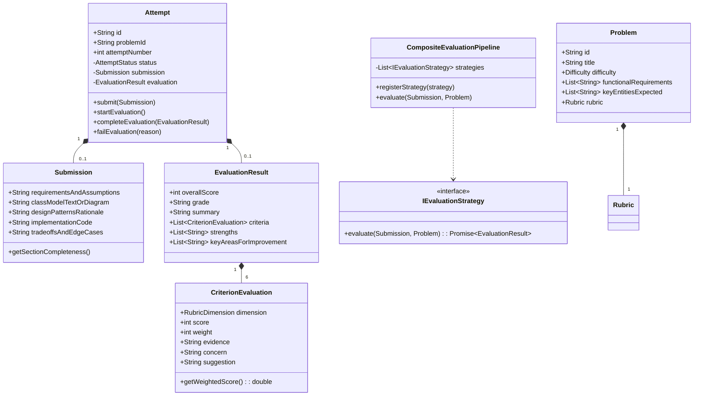

# Design Note: Low-Level Architecture & Domain Model
**Candidate:** Priyanshu  
**Assignment:** LLD Practice Platform — Engineering Assignment  
**Date:** September 2026  

---

## 1. The MVP Scope & User Flow

The goal of this MVP is to build a fast, reliable practice loop that helps a developer improve their Low-Level Design skills through repeated attempts:

```
[Choose Problem] ──> [Structured 5-Part Canvas] ──> [Submit Solution]
                                                          │
                                                          ▼
[Compare Attempts] <── [Review Attempt History] <── [Evidence-Based Feedback]
```

1. **Pick a Problem:** The learner chooses from 5 curated classic LLD problems (*Parking Lot*, *Elevator System*, *Vending Machine*, *Rate Limiter*, *Splitwise*), each with clear requirements, constraints, and hints.
2. **Work on the Solution:** Instead of a single text box, the learner provides their assumptions, class relationships, design patterns, code, and concurrency trade-offs.
3. **Submit & Evaluate:** The system validates basic structure deterministically, runs the evaluation pipeline, and generates structured rubric feedback.
4. **Review & Iterate:** The learner reviews specific suggestions, starts **Attempt #2**, and opens the **Comparison Modal** to see if their score and architectural decisions improved.

---

## 2. Domain Model & Class Responsibilities

I structured the backend using clean Object-Oriented principles and Domain-Driven Design (DDD) boundaries. The core entities and their responsibilities are:



### Why each class exists:

* **`Problem` (Aggregate Root):** Represents the problem specification, requirements, constraints, expected domain nouns, and rubric weights.
* **`Attempt` (State Machine):** Manages the lifecycle of a learner's attempt. It strictly controls valid state transitions:
  $$\text{CREATED} \longrightarrow \text{SUBMITTED} \longrightarrow \text{EVALUATING} \longrightarrow \text{COMPLETED} \; / \; \text{FAILED}$$
  This ensures an attempt cannot be evaluated before being submitted, and protects against invalid operations.
* **`Submission` (Value Object):** Holds the learner's 5 design inputs and calculates section completeness.
* **`Rubric` & `CriterionEvaluation` (Value Objects):** Represents the 6 design dimensions. Each criterion encapsulates: `score`, `weight`, `evidence` (quote from submission), `concern`, `suggestion`, and `confidence`.
* **`IEvaluationStrategy` (Strategy Pattern):** An interface that defines how any evaluation engine (LLM, Heuristic rule engine, AST parser) must evaluate a submission.
* **`CompositeEvaluationPipeline` (Pipeline Pattern):** Runs pre-flight deterministic checks and then executes evaluation strategies in priority order with fallback resilience.

---

## 3. Division of Labor: Deterministic vs. AI Logic

One of the main design questions in this assignment is: *Which parts should be deterministic, and which parts benefit from an LLM?*

Rather than asking an LLM to do everything (which leads to hallucinations and unreliable scores), I separated the responsibilities:

| Task | Handled By | Why |
| :--- | :--- | :--- |
| **Input validation & spam detection** | Deterministic (`ISubmissionValidator`) | Fast, zero-cost checks for empty fields, character counts, and placeholder text (`lorem ipsum`, `todo`). |
| **State transitions & attempt sequencing** | Deterministic (`Attempt`) | Invariant rules belong in the domain entity, not in AI logic. |
| **Weighted score calculation** | Deterministic (`Rubric`) | Overall scores are calculated strictly by multiplying criterion scores with pre-set weights, avoiding math errors. |
| **Keyword & modifier detection** | Deterministic Heuristic | Checks for explicit modifiers (`synchronized`, `volatile`, `interface`, `private`) and GoF pattern mentions. |
| **Responsibility analysis & trade-offs** | Structured LLM / Heuristic | Assessing whether a class has too many responsibilities (SRP) or whether coupling is too tight requires semantic reasoning. |
| **Evidence extraction & actionable advice** | Structured LLM / Heuristic | Pulling relevant quotes from candidate text and providing targeted suggestions for the next attempt. |

---

## 4. Extensibility Tests (Change Tests A & B)

### Change Test A: Supporting a New Submission Format
*Question: Today the learner submits text and code. Later we add an interactive visual class diagram tool. How much of the domain model changes?*

* **Impact on core domain: ZERO changes to `Problem`, `Attempt`, `EvaluationResult`, or `AttemptService`.**
* What changes:
  1. Add `'diagram_json'` to the `format` property in `Submission`.
  2. Implement an `IDiagramParser` or a strategy that understands node-edge graphs.
  3. Register the strategy in `CompositeEvaluationPipeline`.

### Change Test B: Adding a New Evaluator
*Question: Later we add an AST static analysis tool or human peer reviews. Can we plug it in without rewriting the practice flow?*

* **Impact on core flow: ZERO changes to the attempt lifecycle.**
* What changes:
  1. Create a class implementing `IEvaluationStrategy` (e.g. `AstLinterEvaluator` or `HumanReviewEvaluator`).
  2. Call `pipeline.registerStrategy(new AstLinterEvaluator())`.
  3. The `AttemptService`, API routes, and frontend state machine continue working without any modifications.

---

## 5. Practical Reliability, Async Handling & Scale

To keep the system robust without over-engineering distributed microservices:

1. **Save Before Evaluating:** When a user clicks submit, the submission is saved to the database/repository in the `SUBMITTED` state **before** the evaluator runs. If the AI service times out or the network drops, the candidate's work is never lost.
2. **Graceful Fallback:** If no OpenAI/Gemini API key is provided, or if an API call times out, the pipeline automatically falls back to `HeuristicRubricEvaluator`. The app runs 100% offline out-of-the-box.
3. **Failure Recovery:** If evaluation encounters an error, the attempt moves to `FAILED` with a human-readable `failureReason`, and the user can click **Retry** with one click.
4. **Idempotency:** Re-submitting an already evaluated attempt is blocked by the entity state guard.
5. **Path to Scale (Lightweight HLD):** For this prototype, a clean in-memory monolith is fast and simple. If traffic grows, the easiest scaling step is:
   - Swap `InMemoryAttemptRepository` with a PostgreSQL database.
   - Offload the evaluation call to a background job queue (e.g. BullMQ / Redis) and push real-time updates to the UI via Server-Sent Events (SSE).
