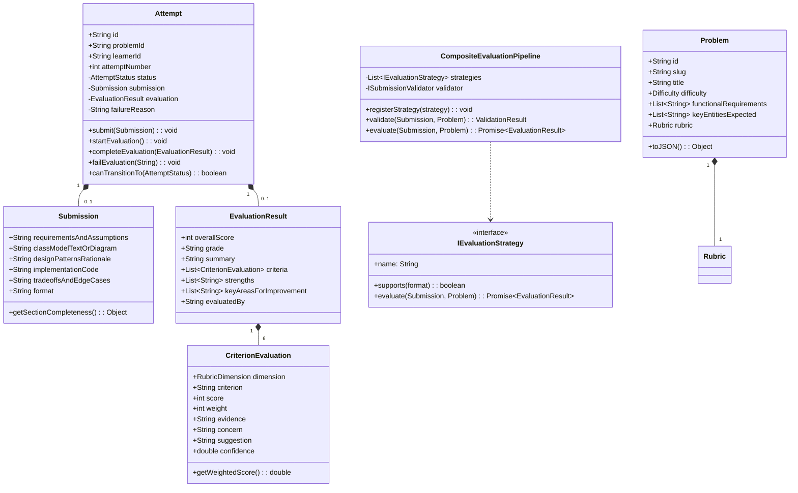

# Design Note: Low-Level Architecture & Domain Model
**Author:** Priyanshu (Candidate Submission)  
**Date:** September 2026  
**Assignment:** CipherSchools Hiring Assignment - LLD Practice Platform  

---

## 1. MVP Scope & User Journey
The platform delivers a focused, zero-bloat practice loop engineered for iterative mastery of Low-Level Design:

```
[Choose Problem] ──> [Structured Design Canvas] ──> [Submit Solution]
                                                           │
                                                           ▼
[Compare Attempts] <── [Review Attempt History] <── [Explainable Feedback]
```

1. **Problem Exploration**: The learner selects a problem (e.g. *Parking Lot*, *Elevator Control*, *Vending Machine*, *Rate Limiter*, *Splitwise*) with explicit functional requirements, non-functional constraints, and dimensional rubric weights.
2. **Structured Architectural Canvas**: The learner supplies 5 design dimensions: *Requirements & Scope*, *Class Structure / UML*, *Design Patterns Rationale*, *Implementation Code*, and *Trade-offs & Concurrency*.
3. **Resilient Evaluation Engine**: The submission is stored safely before undergoing a composite pipeline (Deterministic Validator $\rightarrow$ Rubric-driven LLM Evaluator $\rightarrow$ Heuristic Fallback).
4. **Explainable Feedback**: Feedback provides overall score, grade, verbatim quoted *evidence*, identified *concerns*, and actionable *suggestions* per rubric dimension.
5. **Iterative Progression Tracking**: The learner creates Attempt #2, reviews delta metrics ($\Delta \text{Score}$ per dimension), and verifies architectural growth.

---

## 2. Core Domain Model & Class Responsibilities

The domain model follows pure **Domain-Driven Design (DDD)** with clean separation of entities, value objects, domain interfaces, and strategy pipelines:



### Class Responsibilities Matrix

| Class / Interface | Pattern / Archetype | Primary Responsibility |
| :--- | :--- | :--- |
| `Problem` | Entity (Aggregate Root) | Holds problem specifications, constraints, key expected entities, and custom `Rubric`. |
| `Attempt` | Entity (State Machine) | Manages learner attempt lifecycle, enforces valid status transitions, and preserves historical data. |
| `Submission` | Value Object | Encapsulates candidate multi-section design input with completeness calculation methods. |
| `Rubric` | Value Object | Defines evaluation dimensions and normalizes criteria weights to 100%. |
| `EvaluationResult` | Value Object | Bundles overall score, letter grade, and dimensional criteria breakdown. |
| `CriterionEvaluation` | Value Object | Encapsulates single-dimension feedback (`score`, `evidence`, `concern`, `suggestion`, `confidence`). |
| `IEvaluationStrategy` | Strategy Pattern | Abstraction contract for pluggable evaluation engines (LLM, Heuristic, AST). |
| `CompositeEvaluationPipeline` | Pipeline / Chain | Orchestrates pre-flight validation and prioritized evaluator execution with fallback resilience. |
| `IAttemptRepository` | Repository Pattern | Persistence boundary decoupling attempt lifecycle from storage technology. |

---

## 3. Evaluation Approach: Deterministic vs. AI Division of Labor

A central architectural decision is avoiding generic unconstrained prompts (e.g. *"Is this good code?"*). We divide responsibilities between deterministic algorithms and LLM reasoning:

```
[Incoming Submission]
         │
         ▼
┌──────────────────────────────────────┐
│ Deterministic Pre-Flight Validator   │ ──> (Fails if empty, placeholder, or malformed)
└──────────────────────────────────────┘
         │ Passes
         ▼
┌────────────────────────────────────────────────────────┐
│ Primary Evaluator: Structured JSON Schema LLM Strategy │
│ (Evaluates SRP, coupling, pattern fit, trade-offs)     │
└────────────────────────────────────────────────────────┘
         │ (If API key absent, network timeout, or schema error)
         ▼ [Automatic Fallback]
┌────────────────────────────────────────────────────────┐
│ Secondary Evaluator: Heuristic Deterministic Strategy  │
│ (Regex entity extraction, interface check, God-class   │
│ detection, concurrency modifier parsing)               │
└────────────────────────────────────────────────────────┘
         │
         ▼
┌──────────────────────────────────────┐
│ Final Normalized EvaluationResult    │
└──────────────────────────────────────┘
```

### Deterministic vs. LLM Responsibilities

| Responsibility Area | Handled By | Why This Division Is Optimal |
| :--- | :--- | :--- |
| **Section Completeness & Length** | Deterministic Pre-Flight | Fast, zero-cost rejection of empty or placeholder submissions. |
| **State Machine Transitions** | Deterministic (`Attempt`) | Invariant protection; prevents illegal transitions (e.g. evaluating before submitting). |
| **Mathematical Weight Sums** | Deterministic (`Rubric`) | Eliminates LLM calculation hallucinations; ensures score is strictly normalized to 100. |
| **Entity & Modifiers Detection** | Deterministic Heuristic | Extracts keywords (`synchronized`, `interface`, `implements`) instantly without external API dependencies. |
| **Architectural Cohesion & SRP** | LLM / Semantic Heuristic | Evaluates if a class has single responsibility or is doing too much. |
| **Evidence Extraction & Actionable Suggestions** | LLM / Rule Heuristic | Quotes candidate code directly and provides actionable engineering remedies. |

---

## 4. Extensibility Tests (Change Tests A & B)

### Change Test A: Introducing a New Submission Format (e.g. Interactive UML / AST)
*Question: Today the learner submits text/code. Later the platform supports an interactive visual UML class diagram. How much of the domain model changes?*

- **Domain Impact: ZERO changes to `Problem`, `Attempt`, `EvaluationResult`, or `AttemptService`.**
- **Changes Required**:
  1. Add `'interactive_uml'` to the `format` discriminator in `Submission`.
  2. Implement an `IInteractiveUmlParser` or specialized `IEvaluationStrategy` that parses UML nodes/edges.
  3. Register the new strategy in `CompositeEvaluationPipeline`.

### Change Test B: Adding a New Evaluator (e.g. Static AST Analyzer or Human Peer Review)
*Question: Later we add an AST rule-based linter or peer reviewer. Can we add it without rewriting the practice flow?*

- **Domain Impact: ZERO changes to core attempt orchestration.**
- **Changes Required**:
  1. Create `class AstStaticAnalysisEvaluator implements IEvaluationStrategy`.
  2. Call `pipeline.registerStrategy(new AstStaticAnalysisEvaluator())`.
  3. The `AttemptService` and API routes remain 100% untouched.

---

## 5. Failure Handling, Asynchronous Resilience & Scale

1. **Submission Persistence Before Evaluation:**
   When `POST /api/attempts/:id/submit` is called, the `Attempt` state transitions to `SUBMITTED` and is persisted **before** calling the evaluation strategy. If the evaluator crashes or network drops, the candidate's work is never lost.
2. **State Machine Lifecycle:**
   `CREATED` $\longrightarrow$ `SUBMITTED` $\longrightarrow$ `EVALUATING` $\longrightarrow$ `COMPLETED` / `FAILED`.
   If evaluation fails, the attempt is marked `FAILED` with `failureReason`, enabling one-click retry via `POST /api/attempts/:id/retry`.
3. **Idempotency & Concurrency:**
   Attempt numbers are sequential per problem/learner. Submitting an already completed attempt is blocked by the entity state guard.
4. **Scaling Path (Lightweight HLD Evolution):**
   - **Phase 1 (Current Prototype):** Fast in-memory repository with async non-blocking evaluation and instant heuristic fallback.
   - **Phase 2 (Production Scale):** Replace `InMemoryAttemptRepository` with `PostgresAttemptRepository` (Prisma/TypeORM). Move LLM evaluation from in-process promises to a Redis-backed worker queue (BullMQ / Celery) with server-sent events (SSE) for real-time client updates.
